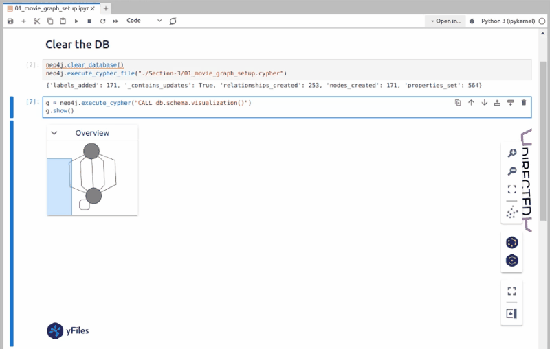
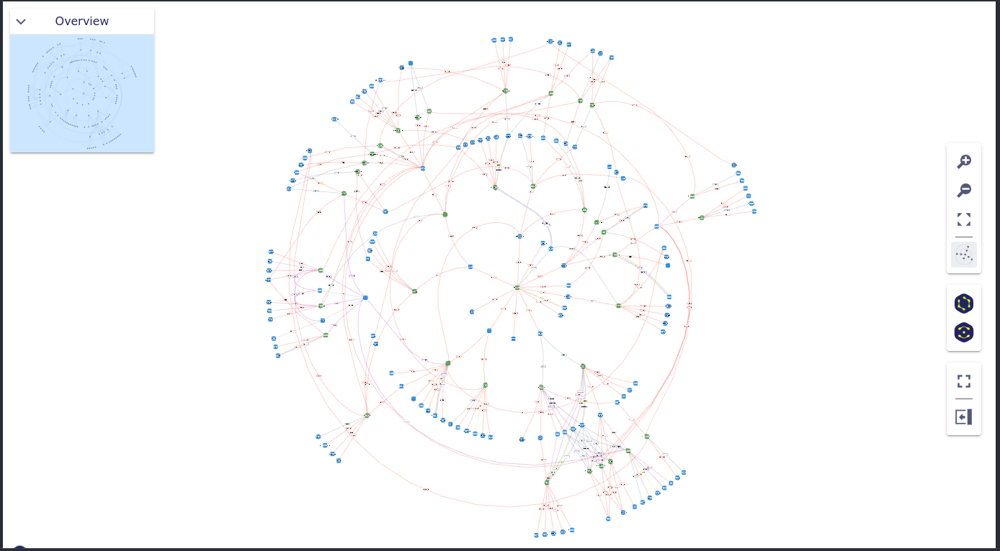
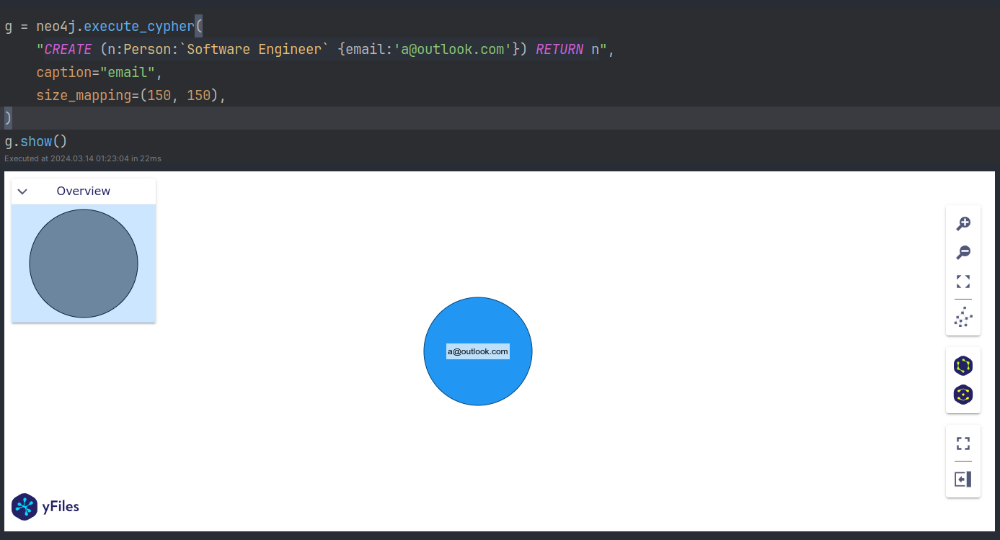

# Neo4j Bootcamp Repository

This repository contains my personal notes and assignments from the `2024 Complete Neo4j GraphDB Bootcamp` on Udemy.
It's designed to help anyone interested in learning about Neo4j graph database technology through practical examples and
real-world applications.







## Getting Started

The environment includes:

- Neo4j 4.4-community edition
- Jupyter notebook server
- jupyterlab-lsp
- jupyterlab_code_formatter
- Networkx
- Neo4j Python driver
- yfiles_jupyter_graphs

### Prerequisites

- **Config files**: Ensure the `/.configs/jupyter.env` and `./configs/neo4j.env` files have the correct ports and
  passwords.
- **Jupyter plugins**: Modify `./configs/jupyter-entrypoint.sh` to install necessary Jupyter plugins or Python
  libraries.
- **Docker**: Docker must be installed on your machine.

### Running the Servers

To start the Neo4j 4.4-community edition and Jupyter notebook server, execute:

```shell
docker network create neo4j-bootcamp-network
docker volume create neo4j-bootcamp-db-data
docker compose up -d
```

### Jupyter Notebook Lab

Access the Jupyter Notebook Lab
at [http://localhost:8888/lab](http://localhost:8888/lab/workspaces/auto-c/tree/work?token=neo4j-bootcamp). Default
token: `neo4j-bootcamp` (change the port if it has been changed in `configs/jupyter.env`).

### Neo4j Browser

Access the Neo4j Browser at http://localhost:7474. Default username: `neo4j`, database:`neo4j`, password: `password`.
(change the values if they have been changed in `configs/jupyter.env`).

## Managing nbstripout

To install nbstripout, run:

```shell 
pip install nbstripout
nbstripout --install
```

### disable nbstripout

If you want to disable nbstripout before merge:

### Disable nbstripout
```shell
sed -i '/^\(\*.ipynb filter=nbstripout\|*.zpln filter=nbstripout\|*.ipynb diff=ipynb\)$/s/^#*/#/' .gitattributes
```

### re-enable nbstripout

```shell
sed -i '/^#*\(\*.ipynb filter=nbstripout\|*.zpln filter=nbstripout\|*.ipynb diff=ipynb\)$/s/^#*//'  .gitattributes
```

## Destroying the Environment

To remove all components:

```shell
docker compose down -v
docker volume rm neo4j-bootcamp-db-data
docker network rm neo4j-bootcamp-network
nbstripout --uninstall
```

## Author

Mo Sorkhpar, [LinkedIn](https://www.linkedin.com/in/mosorkhpar/)